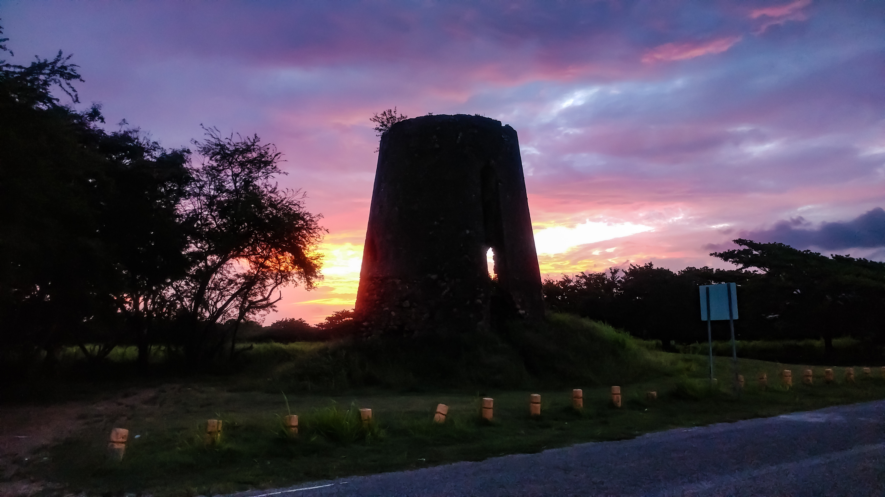

---
title: El Sureste de Puerto Rico Se Levanta
---  

## Bienvenidos a la Iniciativa "El Sureste de Puerto Rico Se Levanta"

[**Quienes Somos**](https://friveramariani.github.io/suresteselevanta/about) | [**Donativos**](https://friveramariani.github.io/suresteselevanta/donativos) | [**Donativos**](https://friveramariani.github.io/suresteselevanta/info)

 Esta iniciativa organizada, por Graduados de la Escuela Superior Carmen Bozello de Hueyke de Arroyo, tiene como misión garantizar que la ayuda a corto y largo plazo llegue a los nuestros en los pueblos de [Guayama](https://en.wikipedia.org/wiki/Guayama,_Puerto_Rico), [Arroyo](https://en.wikipedia.org/wiki/Arroyo,_Puerto_Rico), y [Patillas](https://en.wikipedia.org/wiki/Patillas,_Puerto_Rico). 

Estamos recaudando fondos para cubrir las neceisdades de todas las comunidades de la zona. La idea es ayudar a los gobiernos municipales con dinero para comprar lo que sea necesario, cubrir necedidades directas de organizaciones locales o individuos. Igualmente, comprar materiales necesarios y envairlos por avión y correo tan pronto sea posible. La idea es que no importa donde estemos, podamos ayudar directamente a nuestra zona

Para más información de cómo puedes aportar monetariamente, visita nuestra página de [**Donativos**](https://friveramariani.github.io/suresteselevanta/donativos).

¡Contamos con su apoyo!