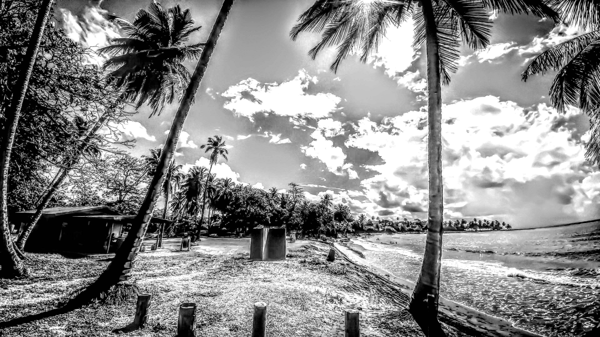

---
title: Otras Fuentes de Información
---  

## Otras Fuentes de Información que Pueden Servir de Ayuda

[**Página Inicial**](https://friveramariani.github.io/suresteselevanta) | [**Quienes Somos**](https://friveramariani.github.io/suresteselevanta/about) | [**Donativos**](https://friveramariani.github.io/suresteselevanta/donativos) 

En esta página, puedes encontrar varios enlaces y fuentes de información que pueden servir de ayuda a los nuestros en el proceso de recuperación a raíz del huracán María, como por ejemplo información de

- [***Asistencia Gubernamental***](#Asistencia Gubernamental)
- [***Servicio de Envío](#Servicio de Envío***)
- [***Sugerencias y Soluciones Caseras***](#Sugerencias y Soluciones Caseras)
- [***Como Ayudar en la Educación Universitaria***](#Como Ayudar en la Educación Universitaria)
- entre otros que continuamente estaremos compartiendo

#### Asistencia Gubernamental
##### *FEMA (Federal Emergency Management Agency)*
- *Accede a este enlace:* [https://www.disasterassistance.gov/es](https://www.disasterassistance.gov/es)
- *teléfono:* **1-800-621-FEMA (3362)**
- *horarios:* **7:00AM a 10:00PM**

##### *Disaster Unemployment Benefits*
- *Accede a este enlace:* [https://www.benefits.gov/benefits/benefit-details/597](https://www.benefits.gov/benefits/benefit-details/597)
- *teléfono:* **1-877-872-5627**
- *teléfono:* **1-877-889-5627 (con asistencia auditva)**

##### *Enlace para contactar a congresistas a tomar acción:*

- [https://docs.google.com/document/d/1LPS_qgFaDO9fDeAz7ExjsMmYwZHPRAuUR43MpYogN5M/mobilebasic](https://docs.google.com/document/d/1LPS_qgFaDO9fDeAz7ExjsMmYwZHPRAuUR43MpYogN5M/mobilebasic)
- *teléfono:* **202-224-3121**

#### Servicio de Envío
##### *PrycoMovers*
- *Accede a este enlace:* [https://www.facebook.com/PrycoMovers/posts/910345142454502](https://www.facebook.com/PrycoMovers/posts/910345142454502)
- *teléfono*: **1-877-507-2650**
- **Almacenes**:
	+ Orlando, Florida (2221-C North Forsyth Road, Orlando, Florida 32807)
	+ Worcester, Massachusetts (240 Barber Ave. Worcester MA 01606)
	+ Philadelphia, Pennsylvania (238 West Cambria St. Philadelphia, PA 19133)
	+ Carolina, PR (Parque Industrial Julio N. Matos, Carolina, PR)

#### Sugerencias y Soluciones Caseras
##### *Forma correcta de utilizar las cajas "Flat Rate" del servicio postal*
[https://www.facebook.com/Lizita02/videos/10212727007663194/](https://www.facebook.com/Lizita02/videos/10212727007663194/)

##### *Utilizar bateria de carro para energizar enseres*

[https://www.facebook.com/annette.larroysanabria/videos/pcb.1633799110024940/1633791693359015/?type=3&theater](https://www.facebook.com/annette.larroysanabria/videos/pcb.1633799110024940/1633791693359015/?type=3&theater)

#### Como Ayudar en la Educación Universitaria
Si eres profesor o administrador en una institución universitaria en los Estados Unidos, 
- regístrate en este enlace [https://yalesurvey.qualtrics.com/jfe/form/SV_6YigLXts7kTr2YJ](https://yalesurvey.qualtrics.com/jfe/form/SV_6YigLXts7kTr2YJ) para que extiendas la mano a nuestros colegas universitarios que han perdido sus experimentos y lugares de crear nuevo conocimiento científico a raíz del huracán Maria. 
- registrate en este enlace [https://docs.google.com/forms/d/e/1FAIpQLSftf_7eBWn-n0cjWx-q8bM_BwTmY33vzj93BKHu321bEZOiIw/viewform](https://docs.google.com/forms/d/e/1FAIpQLSftf_7eBWn-n0cjWx-q8bM_BwTmY33vzj93BKHu321bEZOiIw/viewform) para poder identificar voluntarios que puedan cooperar en ofrecer cursos universitarios a estudiantes que hayan visto afectado sus semestres universitarios a raíz del huracán María.

#Puertoricoselevanta
#suresteselevanta
